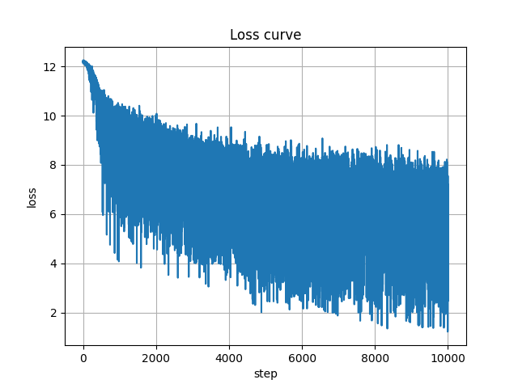
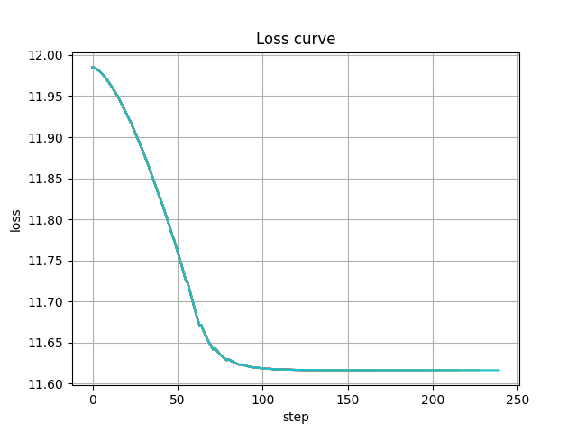

# Pandora

Pandora 是一个完全独立开发的LLM项目，目前还处于早期阶段，主要用于个人研究与探索。该项目采用了旋转位置编码（RoPE）、GPT架构以及SkipGram词嵌入模型，并在训练过程中使用了512长度的上下文。虽然目前Pandora还未完全成熟，但对于感兴趣的开发者和研究者，它提供了一个值得探索的机会。

- [English](./README.en-US.md)
- [中文](./README.md)

## 目录

- [快速开始](#快速开始)
    - [克隆项目](#克隆项目)
    - [安装依赖](#安装依赖)
    - [训练模型](#训练模型)
- [目前性能](#目前性能)
    - [Pandora-loss图](#Pandora-loss图)
    - [SkipGram-loss图](#SkipGram-loss图)
- [版权说明](#版权说明)

## 快速开始

### 克隆项目

```bash
git clone git@github.com:cpcgskill/Pandora.git
```

### 安装依赖

```bash
pip install -r requirements.txt
```

针对Python 3.10用户，由于`datasets`依赖的`multiprocess`存在兼容性问题，需要使用特定版本的依赖文件：

```bash
pip install -r requirements_3_10.txt
```

### 训练模型

- Tokenizer训练：

```bash
python train_tokenizer.py
```

- SkipGram模型训练：

```bash
python train_SkipGram.py
```

- Pandora模型训练：

```bash
python train_Pandora.py
```

## 目前性能

由于模型规模限制，Pandora目前在知识储备方面尚有不足，可能会在处理一些超出其知识范围的问题时出现回答不准确或无法回答的情况。

### Pandora-loss图



### SkipGram-loss图



## 版权说明

本项目采用Apache-2.0许可协议。有关许可的详细信息，请参阅项目中的LICENSE文件。